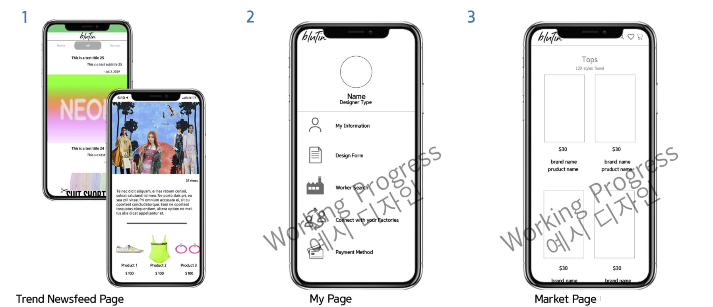
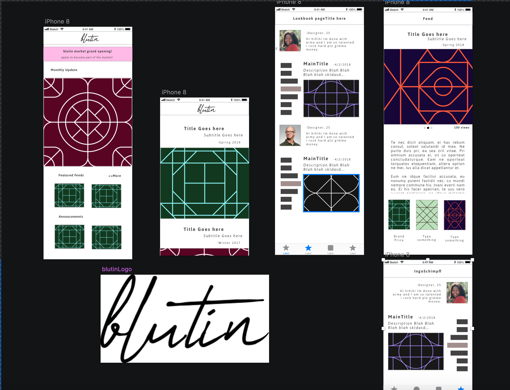
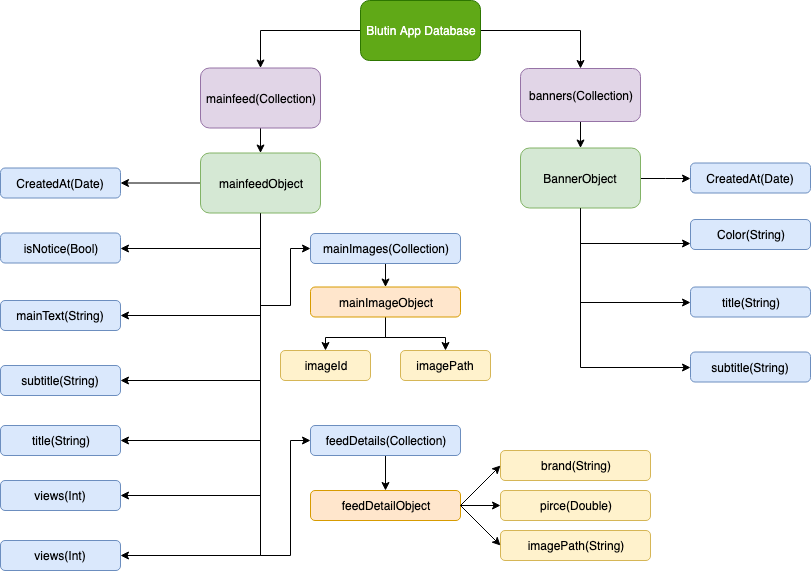
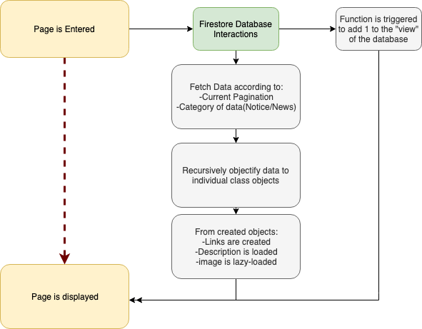

# Bluk-IOS

## Introduction

Bluk-IOS(Blutin) is a native IOS Application using Swift, a prototype to a personal project. 
Original purpose of this application is to provide fashion followers and amateur designers with an easier approach to having their garments produced. 
I originally planned to have three steps to finalizing this application:

1. Provide a feed regarding the latest trending garments and their purchase information.
2. Social networking service to provide users a platform to share their designs in a lookbook fashion. 
3. Provide platform for users to connect to manufacturer and freelancers to help them publish their designs
to real-life products.

Step 1 is complete while step 2 and 3 is paused due to time constraint.

This application and pptx regarding this idea was submitted to Wadiz Idea Contest.

## Components

### UI/UX Design

UI/UX design of the application was created in a way that the user's portfolio can be well adapted in a single page preferrably. The bar-chart similar looking element of the page represents posts(designs) in different years or certain segment of time.

### Data Structure

The overall datastructure of the current version of the application looks like the one above. While implementing the second and the third stage will require additional objects and tokens to be stored, currently the news feed capability only require above mentioned data. 

### Core Algorithm

This version of Blutin(Bluk) only uses interactions with the database, as the only interaction is to fetch & push data.

The order of the page loading algorithm goes:

1. The feed table cell is tapped.
2. The custom class for database fetches determines the details of selection(current Pagination and the category of the feed).
3. A function is called to add a single count to the "view" value of the database.
4. Running 3 in background, the data received are converted into objects.
5. The viewcontroller then renders the data onto the pre-configured view. Here the links, images and texts are loaded accordingly. 

### Prerequisites

* Latest XCode
* Cocoapod installed to computer

## Acknowledgments

* See Podfile

## License

Copyright © 2019 by Seung Yoon Lee
All rights reserved. 

